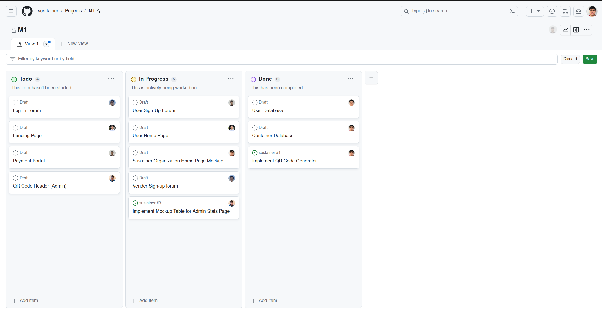
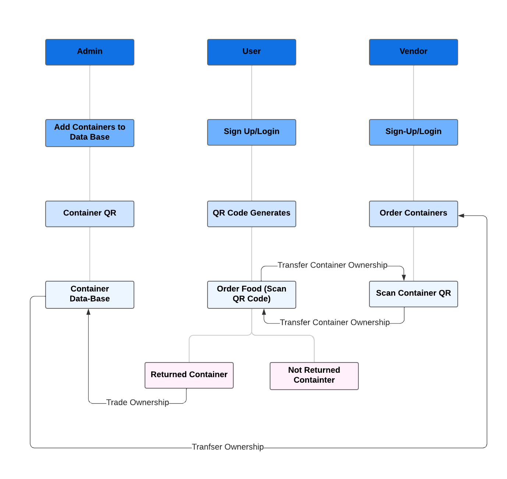
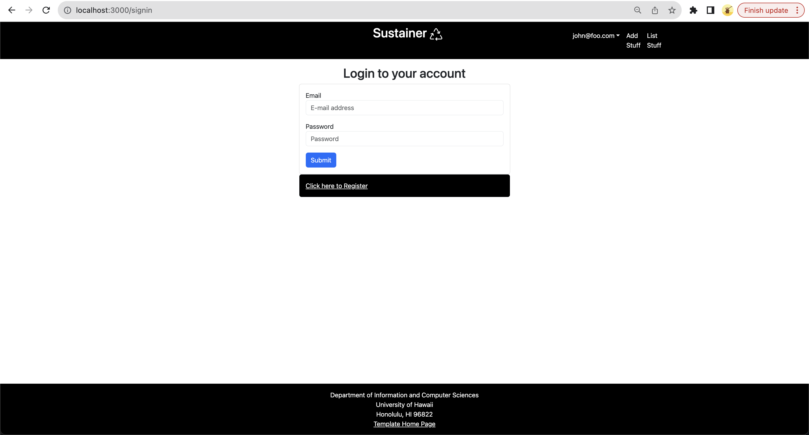
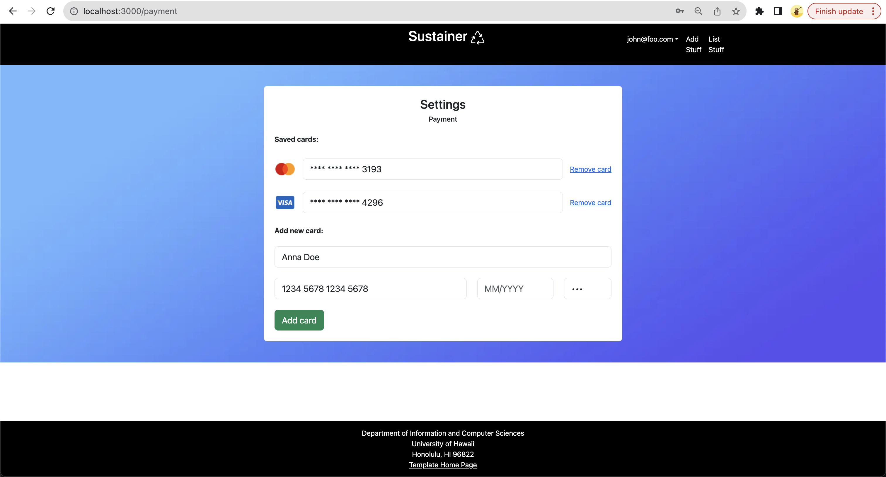

# Sustainer

Sustainer is a reusable container tracking app that helps users and the non-profit Zero Waste O'ahu stay accountable for the return of reusable takeout containers at large events. The initial Full Cycle Takeout pilot program, responsible for creating and renting out reusable takeout containers, has already shown promise in reducing waste for restaurants, but has struggled with the return of the containers. This makes the program unsustainable financially and unsustainable for the planet. Failing to solve this problem leads to more one-time use products becoming trash and more reusable containers needing to be produced. Sustainer aims to solve this problem by providing a platform for Zero Waste O'ahu to track rented out containers and provide incentives for their return. 

## Goals

Sustainer aims to provide the following features:

<li>Account registration</li>
<li>Reusable container ownership tracking</li>
<li>Container ordering from venders</li>
<li>Collateral payments if a container is not returned</li>
<li>QR code scanning and generation</li>
<li>Tracking of returned and non-returned containers</li>

## Milestone 1: Mockup development

The goal of Milestone 1 was to create a work flow for the app and create a mockup of the app's UI.

Milestone 1 was managed using sus-tainer GitHub Project Board M1:

### Application Flowchart

## Mockups

### Login Page

### Payment Portal

### UserRegistration Page

## Team

Sustainer is designed and developed by Aaron Lander Anchetea, Nathaniel Murray, Jaren Pinera, Thomas Rivera, and Sage Suzuki.