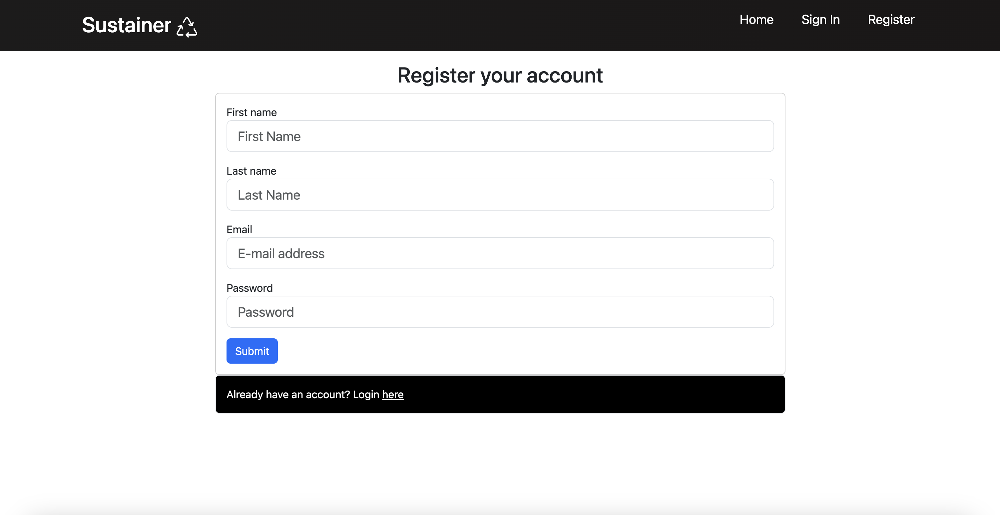
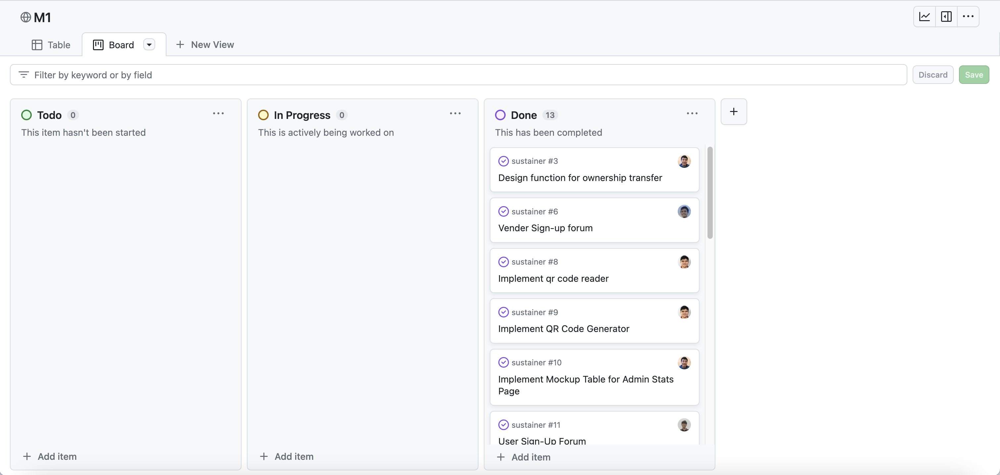

# Sustainer

[View our organization](https://github.com/sus-tainer)

## Table of contents

* [Overview](#overview)
* [Goals](#goals-of-the-app)
* [Application Design](#application-design)
  * [Data Model](#data-model)
  * [Flowchart](#application-flowchart)
* [User Guide](#user-guide-mockups)
* [Development History](#development-history)
  * [Milestone 1](#milestone-1-identifying-basic-user-needs--mockup-page-development)
  * [Milestone 2](#milestone-2-expected-upcoming-issues)
* [Team](#team)
* [Developer Guide](#developer-guide)
* [Community Feedback](#community-feedback)
* [Deployment](#deployment)

## Overview

### What is Sustainer?
Sustainer is a reusable container tracking app that helps users and the non-profit Zero Waste O'ahu stay accountable for the return of reusable takeout containers at large events. The initial Full Cycle Takeout pilot program, responsible for creating and renting out reusable takeout containers, has already shown promise in reducing waste for restaurants, but has struggled with the return of the containers. This makes the program unsustainable financially and unsustainable for the planet. Failing to solve this problem leads to more one-time use products becoming trash and more reusable containers needing to be produced. Sustainer aims to solve this problem by providing a platform for Zero Waste O'ahu to track rented out containers and provide incentives for their return. 

## Goals of the app

Our web app aims to provide the following features:

<li>Account registration</li>
<li>Reusable container ownership tracking</li>
<li>Ordering containers from venders</li>
<li>Distributing containers to venders from organization</li>
<li>Collateral payments if a container is not returned</li>
<li>QR code scanning and generation</li>
<li>Tracking of returned and non-returned containers</li>


## Application Design

The following describes the design process for our app:

### Data model

As noted above, the Bowfolios data model consists of three "primary" collections (Projects, Profiles, and Interests), as well as three "join" Collections (ProfilesProjects, ProfilesInterests, and ProjectsInterests).  To understand this design choice, consider the situation where you want to specify the projects associated with a Profile.

Design choice #1: Provide a field in Profile collection called "Projects", and fill it with an array of project names. This choice works great when you want to display a Profile and indicate the Projects it's associated with.  But what if you want to go the other direction: display a Project and all of the Profiles associated with it?  Then you have to do a sequential search through all of the Profiles, then do a sequential search through that array field looking for a match.  That's computationally expensive and also just silly.

Design choice #2:  Provide a "join" collection where each document contains two fields: Profile name and Project name. Each entry indicates that there is a relationship between those two entities. Now, to find all the Projects associated with a Profile, just search this collection for all the documents that match the Profile, then extract the Project field. Going the other way is just as easy: to find all the Profiles associated with a Project, just search the collection for all documents matching the Project, then extract the Profile field.

Bowfolios implements Design choice #2 to provide pair-wise relations between all three of its primary collections:


The fields in boldface (Email for Profiles, and Name for Projects and Interests) indicate that those fields must have unique values so that they can be used as a primary key for that collection. This constraint is enforced in the schema definition associated with that collection.

### Application Flowchart


## User Guide (Mockups)

This section provides a mockup walkthrough of the Sustainer user interface and its capabilities.

### Login Page


### Payment Portal


### UserRegistration Page


## Development History

The following describes the process of building the app from the design process to code implementation and deployment. Our progress is as follows:

## Milestone 1: Identifying Basic User Needs & Mockup Page Development

The goal of Milestone 1 was to create a work flow for the app to identify its main features to solve the problem of user accountability and container retention rate. We focused on creating a mockup of the app's UI.

Milestone 1 was managed using [Sus-tainer GitHub Project Board M1](https://github.com/bowfolios/bowfolios/projects/1):



## Milestone 2: Expected Upcoming Issues

We expect the following issues to continue toward Milestone 2:

[Sus-tainer GitHub Project Board M2](https://github.com/bowfolios/bowfolios/projects/2):


## Team

**[Our team contract](https://docs.google.com/document/d/14BCHuLKtjr0m7UcoQ2BcsHvO0r9Z21xhZkRsPpTkm4c/edit?usp=sharing)**

Sustainer is designed and developed by:
* [Aaron Lander Ancheta](https://github.com/aaron-ancheta)
* [Nathaniel Murray](https://github.com/murrayn808)
* [Jaren Pinera](https://github.com/jpinera)
* [Thomas Rivera](https://github.com/thomasarivera)
* [Sage Suzuki](https://github.com/sage-suzuki)


## Developer Guide

This section provides information of interest to Meteor developers wishing to use this code base as a basis for their own development tasks.

### Installation

First, [install Meteor](https://www.meteor.com/install).

Second, visit the [Sustainer application GitHub page](https://github.com/sus-tainer/sustainer), and click the "Use this template" button to create your own repository initialized with a copy of this application. Alternatively, you can download the sources as a zip file or make a fork of the repo.  However you do it, download a copy of the repo to your local computer.

Third, cd into the sustainer/app directory and install libraries with:

```
$ meteor npm install
```

Fourth, run the system with:

```
$ meteor npm run start
```

If all goes well, the application will appear at [http://localhost:3000](http://localhost:3000).

## Community Feedback

**_In progress_**

We are interested in your experience using Sustainer! A form will soon be created to list any suggestions on improving the app.


## Deployment

**_Our app deployment is in progress_**


<!--
## Initialization

The [config](https://github.com/bowfolios/bowfolios/tree/main/config) directory is intended to hold settings files.  The repository contains one file: [config/settings.development.json](https://github.com/bowfolios/bowfolios/blob/main/config/settings.development.json).

This file contains default definitions for Profiles, Projects, and Interests and the relationships between them. Consult the walkthrough video for more details.

The settings.development.json file contains a field called "loadAssetsFile". It is set to false, but if you change it to true, then the data in the file app/private/data.json will also be loaded.  The code to do this illustrates how to initialize a system when the initial data exceeds the size limitations for the settings file.


### Quality Assurance

#### ESLint

BowFolios includes a [.eslintrc](https://github.com/bowfolios/bowfolios/blob/main/app/.eslintrc) file to define the coding style adhered to in this application. You can invoke ESLint from the command line as follows:

```
meteor npm run lint
```

Here is sample output indicating that no ESLint errors were detected:

```
$ meteor npm run lint

> bowfolios@ lint /Users/philipjohnson/github/bowfolios/bowfolios/app
> eslint --quiet --ext .jsx --ext .js ./imports ./tests

$
```

ESLint should run without generating any errors.

It's significantly easier to do development with ESLint integrated directly into your IDE (such as IntelliJ).

#### End to End Testing

BowFolios uses [TestCafe](https://devexpress.github.io/testcafe/) to provide automated end-to-end testing.

The BowFolios end-to-end test code employs the page object model design pattern.  In the [bowfolios tests/ directory](https://github.com/bowfolios/bowfolios/tree/main/app/tests), the file [tests.testcafe.js](https://github.com/bowfolios/bowfolios/blob/main/app/tests/tests.testcafe.js) contains the TestCafe test definitions. The remaining files in the directory contain "page object models" for the various pages in the system (i.e. Home, Landing, Interests, etc.) as well as one component (navbar). This organization makes the test code shorter, easier to understand, and easier to debug.

To run the end-to-end tests in development mode, you must first start up a BowFolios instance by invoking `meteor npm run start` in one console window.

Then, in another console window, start up the end-to-end tests with:

```
meteor npm run testcafe
```

You will see browser windows appear and disappear as the tests run.  If the tests finish successfully, you should see the following in your second console window:

```
$ meteor npm run testcafe

> bowfolios@ testcafe /Users/philipjohnson/github/bowfolios/bowfolios/app
> testcafe chrome tests/*.testcafe.js

 Running tests in:
 - Chrome 86.0.4240.111 / macOS 10.15.7

 Bowfolios localhost test with default db
 ✓ Test that landing page shows up
 ✓ Test that signin and signout work
 ✓ Test that signup page, then logout works
 ✓ Test that profiles page displays
 ✓ Test that interests page displays
 ✓ Test that projects page displays
 ✓ Test that home page display and profile modification works
 ✓ Test that addProject page works
 ✓ Test that filter page works


 9 passed (40s)

 $
```

You can also run the testcafe tests in "continuous integration mode".  This mode is appropriate when you want to run the tests using a continuous integration service like Jenkins, Semaphore, CircleCI, etc.  In this case, it is problematic to already have the server running in a separate console, and you cannot have the browser window appear and disappear.

To run the testcafe tests in continuous integration mode, first ensure that BowFolios is not running in any console.

Then, invoke `meteor npm run testcafe-ci`.  You will not see any windows appear.  When the tests finish, the console should look like this:

```
$ meteor npm run testcafe-ci

> bowfolios@ testcafe-ci /Users/philipjohnson/github/bowfolios/bowfolios/app
> testcafe chrome:headless tests/*.testcafe.js -q --app "meteor npm run start"

 Running tests in:
 - Chrome 86.0.4240.111 / macOS 10.15.7

 Bowfolios localhost test with default db
 ✓ Test that landing page shows up (unstable)
 ✓ Test that signin and signout work
 ✓ Test that signup page, then logout works
 ✓ Test that profiles page displays
 ✓ Test that interests page displays
 ✓ Test that projects page displays
 ✓ Test that home page display and profile modification works
 ✓ Test that addProject page works
 ✓ Test that filter page works


 9 passed (56s)

$
```

All the tests pass, but the first test is marked as "unstable". At the time of writing, TestCafe fails the first time it tries to run a test in this mode, but subsequent attempts run normally. To prevent the test run from failing due to this problem with TestCafe, we enable [testcafe quarantine mode](https://devexpress.github.io/testcafe/documentation/guides/basic-guides/run-tests.html#quarantine-mode).

The only impact of quarantine mode should be that the first test is marked as "unstable".

## From mockup to production

Bowfolios is meant to illustrate the use of Meteor for developing an initial proof-of-concept prototype.  For a production application, several additional security-related changes must be implemented:

* Use of email-based password specification for users, and/or use of an alternative authentication mechanism.
* Use of https so that passwords are sent in encrypted format.
* Removal of the insecure package, and the addition of Meteor Methods to replace client-side DB updates.

(Note that these changes do not need to be implemented for ICS 314, although they are relatively straightforward to accomplish.)

## Continuous Integration


BowFolios uses [GitHub Actions](https://docs.github.com/en/free-pro-team@latest/actions) to automatically run ESLint and TestCafe each time a commit is made to the default branch.  You can see the results of all recent "workflows" at [https://github.com/bowfolios/bowfolios/actions](https://github.com/bowfolios/bowfolios/actions).

The workflow definition file is quite simple and is located at
[.github/workflows/ci.yml](https://github.com/bowfolios/bowfolios/blob/main/.github/workflows/ci.yml).

* [Continuous Integration](#continuous-integration)
* [Walkthrough videos](#walkthrough-videos)
* [Example enhancements](#example-enhancements)


* [Meteor](https://www.meteor.com/) for Javascript-based implementation of client and server code.
* [React](https://reactjs.org/) for component-based UI implementation and routing.
* [React Bootstrap](https://react-bootstrap.github.io/) CSS Framework for UI design.
* [Uniforms](https://uniforms.tools/) for React and Semantic UI-based form design and display.

It also provides code that implements a variety of useful design concepts, including:

* Three primary collections (Profiles, Projects, Interests) as well as three "join" Collections (ProfilesInterests, ProfilesProjects, and ProjectsInterests) that implement many-to-many relationships between them.
* Top-level index pages (Profiles, Interests, and Projects) that show how to manipulate these six collections in various ways.
* Initialization code to define default Profiles, Interests, and Projects and relations between them.
* A simple Filter page to illustrate how to perform simple queries on the database and display the results.
* Use of Meteor Methods to illustrate how to simplify implementation of multiple collection updates.
* Use of indexes to enforce uniqueness of certain fields in the collections, enabling them to serve as primary keys.
* Authentication using the built-in Meteor accounts package along with Sign Up and Sign In pages.
* Authorization examples: certain pages are public (Profiles, Projects, Interests), while other pages require login (AddProject, Filter).
* Use of Meteor Assets to initialize the database (helpful when initialization exceeds settings file size limits).
-->

<!--
## Milestone 3: 

The goal of Milestone 3 was to clean up the code base and fix minor UI issues.

Milestone 3 was managed using [BowFolio GitHub Project Board M3](https://github.com/bowfolios/bowfolios/projects/3):


As of the time of writing, this screenshot shows that there is an ongoing task (i.e. this writing).

Need to do:
1. Link Team contract
2. Update User guide w/ screenshots
3. App design and data model
4. M1 and M2 project fix w/ issues, then right screenshot
5. Copy all contents to repo and name issue branches accordingly
6. (Make team logo)
-->
