# Sustainer

[View our organization](https://github.com/sus-tainer)

## Table of contents

* [Overview](#overview)
* [Goals](#goals-of-the-app)
* [Application Design](#application-design)
  * [Data Model](#data-model)
  * [Flowchart](#application-flowchart)
* [User Guide](#user-guide-updated-progress)
* [Community Feedback](#community-feedback)
* [Developer Guide](#developer-guide)
  * [Deployment](#deployment)
  * [Continuous Integration](#continuous-integration)
  * [Download & Installation](#installation)
* [Development History](#development-history)
  * [Milestone 1](#milestone-1-identifying-basic-user-needs--mockup-page-development)
  * [Milestone 2](#milestone-2-basic-skeleton-of-all-pages-qr-code-functionality)
  * [Milestone 3](#milestone-3-app-cleanup)
* [Team](#team)


## Overview

### What is Sustainer?

Sustainer is a reusable container tracking app that helps users and the non-profit Zero Waste O'ahu stay accountable for the return of reusable takeout containers at large events. The initial Full Cycle Takeout pilot program, responsible for creating and renting out reusable takeout containers, has already shown promise in reducing waste for restaurants, but has struggled with the return of the containers. This makes the program unsustainable financially and unsustainable for the planet. Failing to solve this problem leads to more one-time use products becoming trash and more reusable containers needing to be produced. Sustainer aims to solve this problem by providing a platform for Zero Waste O'ahu to track rented out containers and provide incentives for their return. 

## Goals of the app

Our web app aims to provide the following features:

<li>Account registration</li>
<li>Reusable container ownership tracking</li>
<li>Ordering containers from vendors</li>
<li>Distributing containers to vendors from organization</li>
<li>Collateral payments if a container is not returned</li>
<li>QR code scanning and generation</li>
<li>Tracking of returned and non-returned containers</li>


## Application Design

The following describes the design process for our app:

### Data model

The data model for Sustainer consists of two "primary" collections (Accounts and Containers), along with one "join" Collections (ContainersByRole) and one supplemental collection (Credit Card). 

We decided to present the model in this way to easily keep track of the ownership for each container. Here are some reasons for our design:
* The _role_ field has possibilities of user, vendor, or admin, which will indicate the navigation routes of UI pages upon log in. It will also be used to transfer ownership of a container from an admin (organization worker) to a vendor to a user (customer at the event). 
* The CreditCard collection allows us to link a payment method as collateral for the containers that are ordered. In the scenario where they don't return the containers after the event is over, they will be charged accordingly. 
* Multiple containers can be assigned to a single user. The ContainersByRole join collection help us to easily filter the number of containers by a specific user or owner when an admin/moderator wants to check which containers are available and returned. 

Here is an example schematic of the database:

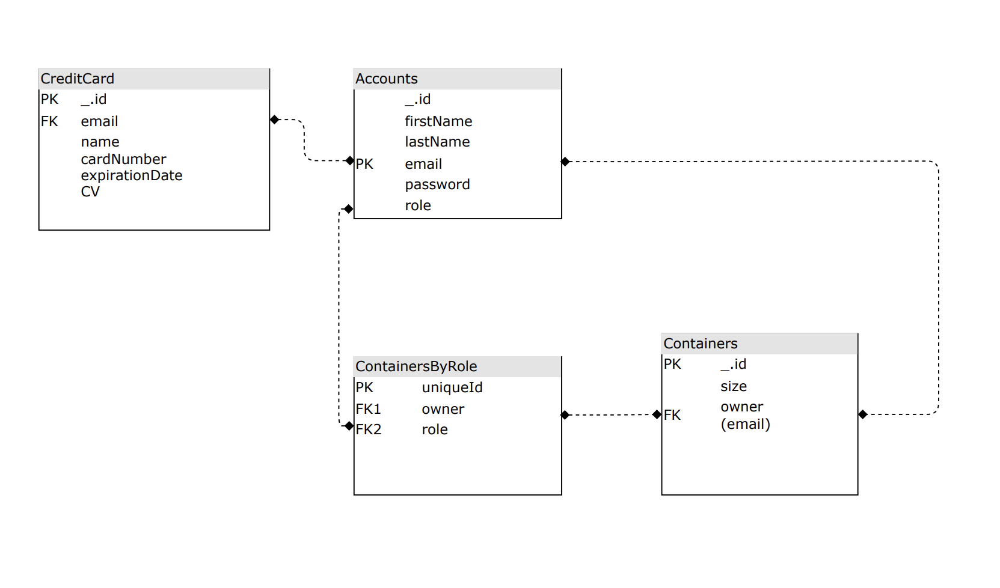

The fields labeled **PK** (Email for Accounts) indicate that this is a unique value so that they can be used as a primary key for that collection. This constraint is enforced in the schema definition associated with that collection. The label **FK** represents the foreign keys that are used from other collections.

### Application Flowchart


## User Guide (Updated Progress)

This section provides a walkthrough of the Sustainer web app including its user interface and its capabilities.

### Landing Page

The landing page is presented to users when they first visit the site. It provides a brief overview and purpose of the app.

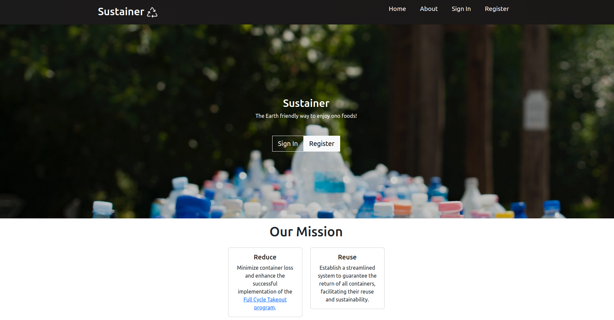

### About Page

Clicking on the "About" nav link in the navigation bar will direct the user to the About page. This page briefly describes the issue and possible solution to sustaining the environment through reusable takeout containers. There is also background information on the nonprofit organization "Zero Waste Oahu", which helps facilitate a full cycle takeout program to users at large public events. 

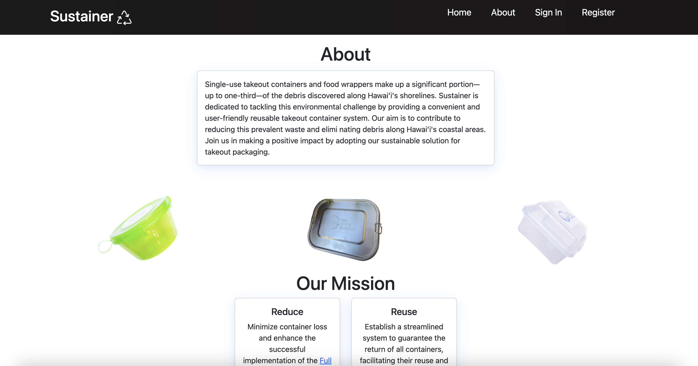

### User Registration Page

To order the reusable containers at events, users must sign up by clicking on the "Sign up" dropdown menu in the upper right corner of the navbar. This registers the user into a system at a certain event and generates a QR code to act as an "ID" for the event.


### Login Page

For returning users, click on the “Login” button in the dropdown located in upper right corner of the navbar, then select “Sign in” to go to get your newly-generated QR code for the event. You must have been previously registered with the system to use this option:

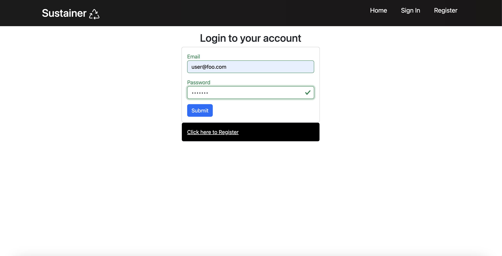

### User Home Page

After logging in, you are taken to the home page, which presents generic information on how to use the app. On this page, there are options to link your credit card information and get your QR code. 

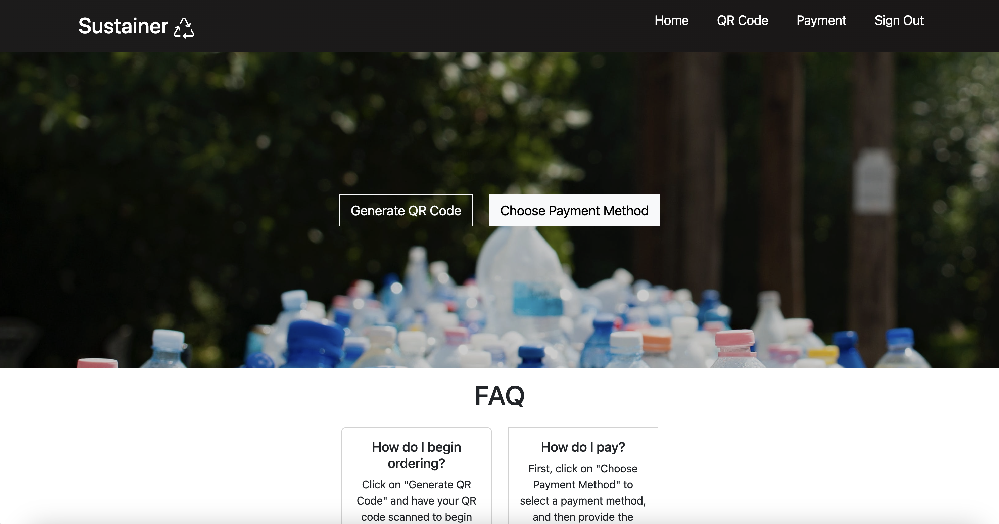

### QR Code Generator

Clicking on "Generate QR Code" will display the user's personal QR code. This will be used when the user orders food at the event. Customers will scan the QR at a food truck or vendor, which will "assign" those containers to them during the event. This helps admin keep track of the containers.

<p align="center">
    
</p>

### Payment Portal

Clicking on "Choose Payment Method" will direct you to form where you can link and input your credit card information. Credit card information is used as collateral for any containers that are ordered and **not** returned within a specific limit or duration of the ongoing event. Upon ordering containers, there will be a pending charge based on the number of containers ordered, with each container charged at a flat rate. Payment will not be processed on your account if containers are returned before the end of the event.


### Vendor Home Page

After logging in as a vendor, there are options to scan a container to assign to a user, order containers for an event, view your order history, and view an inventory of the remaining containers that a vendor has. This is shown on the main page and in the nav bar.

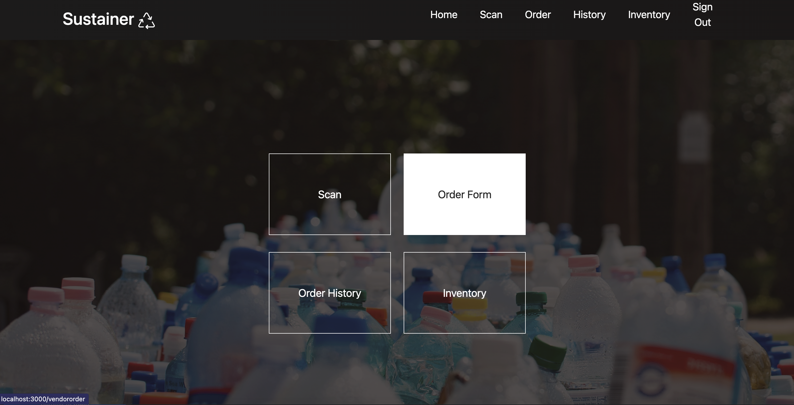

### Vendor Order Form

Upon log in as a vendor, a form is displayed to allow vendors to order a certain number of containers for an event. This allows the Full Cycle Takeout program to accurately distribute the right number of containers to each vendor before a customer uses them when ordering take-out at the event.

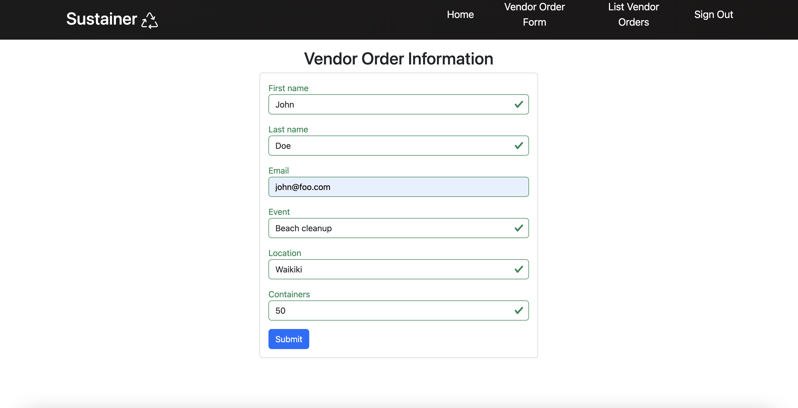

### Vendor Order History Page

Clicking on the "History" nav link will show a history list of order forms that a vendor has filled out for all previous and upcoming events. Vendors will be able to edit current pending forms for an event that hasn't passed. They can also delete forms from their history. An approval status for each order will show if an admin has either approved or rejected their order request of containers. The vendor can also tell if an approval is still pending.

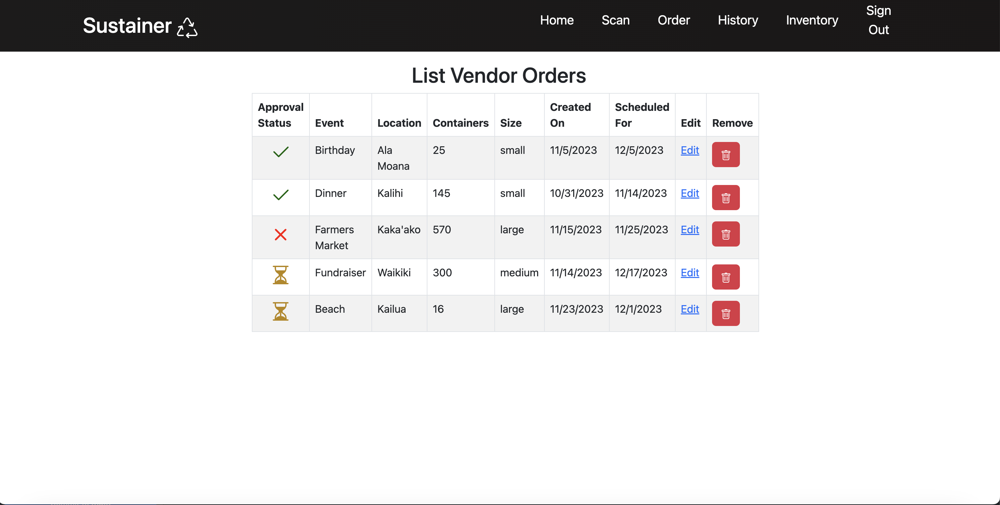

### Vendor Inventory Page

Clicking on the "Inventory" nav link will show the remaining containers that a vendor has left in stock. Vendors can add more containers by clicking on the "Order More" button, which will direct them to an order form page.

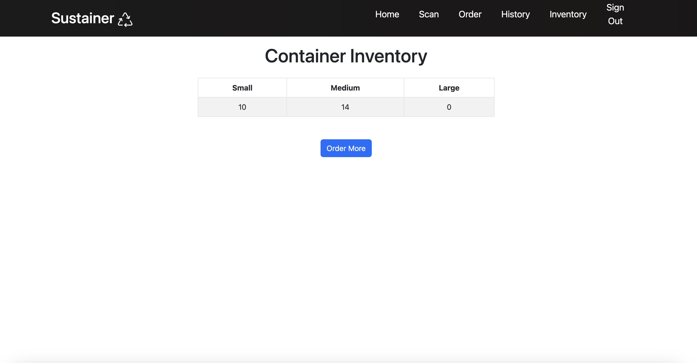

### Admin Home Page

After logging in as an admin, there are options to add new containers to the database, scan a returned container, list all the containers at an event, charge a user accordingly, and approve any pending vendor orders. This is shown on the main page and in the nav bar. There is also a graphic displaying the current container retention rate to keep track of the progress during the event.

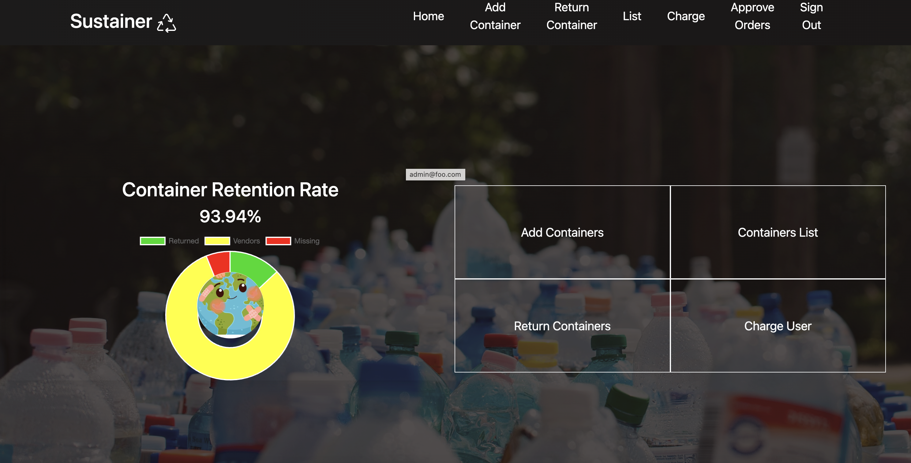

### Scan QR Code Page

After an event is over, moderators (workers) and administrators of the organization can use this page to scan QR codes on the containers and check them back in. This confirms that the user/consumer has returned all of their "assigned" containers from the event. Proper authorized accounts can only access this page by clicking on the "Scan Containers" nav link upon signing in. 

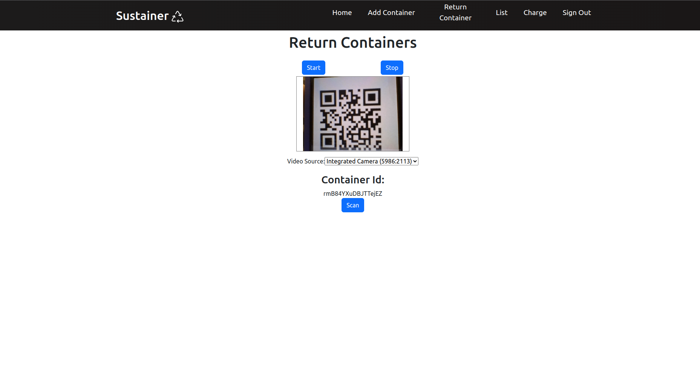

### Admin Stats Page
Admins and moderators can view all containers during an event to accurately track them. This will display all the available containers, as well as the owner that is assigned or responsible for a specific container. The database table UI will also have a search and filter function to find a certain container and check if a specific user has returned their containers respectively. 


There is also a percentage graphic to show the retention rate of the containers. The pie chart will update in real-time when containers are taken out and returned by customers at the event. An environmental graphic will also correspond with the percentage of the containers that are returned. This will indicate the effectiveness of the take-out and return procedure at events, while also evaluating the "efficiency" of this app's functionality.

<div class="justify-content-center text-center p-4" style="padding-top: 5px; padding-bottom: 5px">
  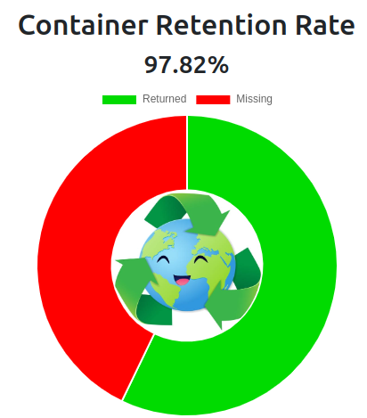
  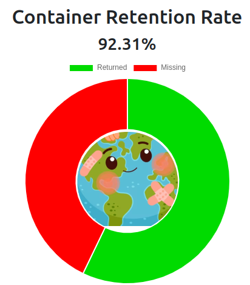
</div>

<div class="justify-content-center text-center p-4" style="padding-top: 5px; padding-bottom: 50px">
  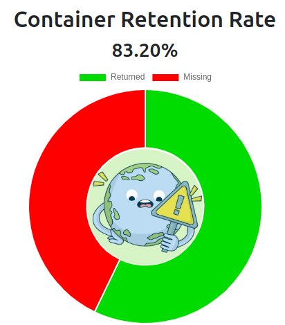
  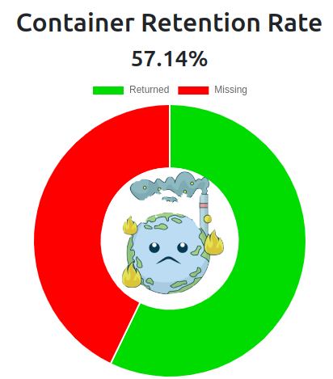
</div>

### Admin Adding Containers

Admins and moderators can add containers to the database by clicking on the "Add Containers" nav link. This will display a form to select the container size to add to the database. This is useful when the organization needs to replace or add more containers to the database for an upcoming event.

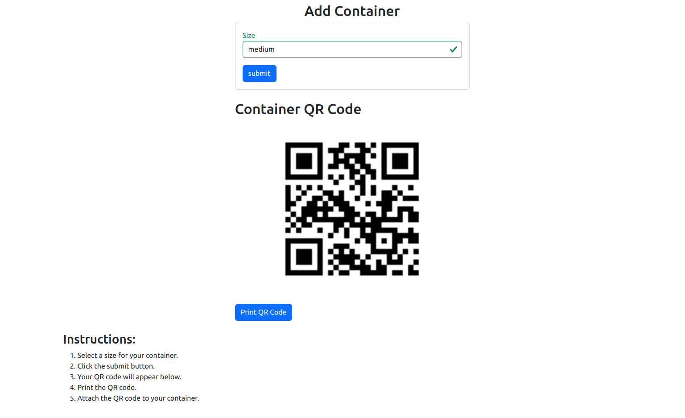

Once submitted, the container will be added to the database and a QR code is generated for the container. A print button is also available to print the QR code for the container.

### Charge User Page

On this page, an admin can charge a user for a specific container that is not returned after the end of an event. This charge will be based on the credit card information that the user provided on their account.

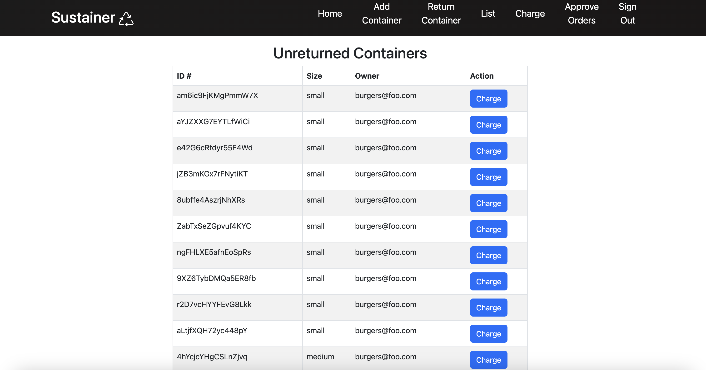

### Approve Orders Page

Admin can also approve or reject requested container forms that are created and edited made by a vendor. Once an action is performed, the specific incoming request is removed from the list. The vendor can then see the approval status for each form, as it is updated in real time.

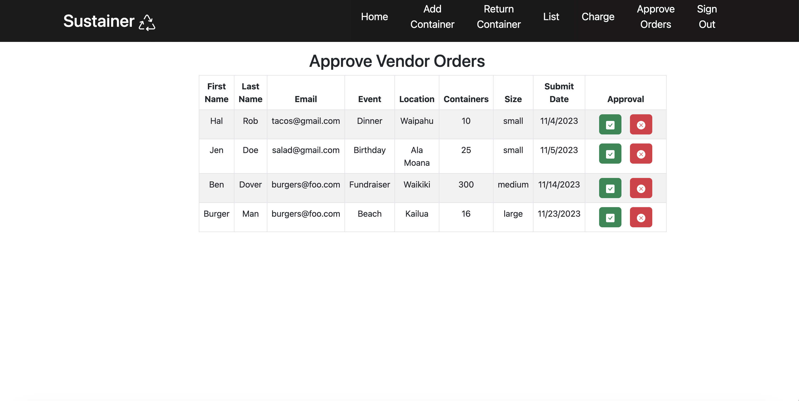

<br>

## Community Feedback

The following highlights some of the feedback that we received from UH community members on our Sustainer app.

* "I like the idea behind the app's functionality. I think that having a QR code scanner for containers is pretty neat. However, it is a little buggy at times. I'm also not sure how reliable connection to the web app will be for outside events." - **_UH Math major student_**

* "One critique i have is their FAQ boxes could be bigger so its like one of the first things you read especially to know what the QR code is for. But other than that their site is simple to use and does what it needs to. " - **_Anonymous_**

* "The interface has a very simple design and layout." - **_UH Medical student_**

* "I found the options for a vendor or admin to be more interesting, though it was quite limited in terms of what I can as a user. In general, I think it's neat to have an app that is intended and usable towards different types of audiences." - **_Former UH student_**

* "The approach of achieving sustainability through reusable containers and holding users accountable is unique. This app attempts to solve this problem in both an effective and simple manner." - **_UH Community Member_**

* "My experience with this app from the user's and admin's point of view was pretty good. The navbar options was also a little confusing at times, but I like the clean layout and interesting graphics!" - **_Donator of UH community_**

* "Users have noted that while our website's design is visually appealing and included unique features, there's a feeling of unpolished in its functionality. Feedback highlights our tailored approach for mobile and desktop platforms, but suggests a need for smoother integration. We acknowledge this valuable input and are committed to refining our features, aiming for a seamless, user-friendly experience that complements our site's aesthetic appeal." - **_Anonymous_**

* "The website is neat and simple to look at. I wouldn't mind using this at events." - **_Anonymous_**

* "There's a lot of empty space in parts of the site. I think it would be better to fill it up with more information or designs." - **_Anonymous_**

<br>

## Developer Guide

### Deployment

You can view our deployed app [**here**](https://sustainer.online): [https://sustainer.online](https://sustainer.online)

The following section provides information of interest to Meteor developers wishing to use this code base as a basis for their own development tasks.

<br>

### Continuous Integration

[](https://github.com/sus-tainer/sustainer/actions/workflows/ci.yml)

Sustainer uses [GitHub Actions](https://docs.github.com/en/free-pro-team@latest/actions) to automatically run ESLint and TestCafe each time a commit is made to the default branch.  You can see the results of all recent "workflows" at [https://github.com/sus-tainer/sustainer/actions](https://github.com/sus-tainer/sustainer/actions).

The workflow definition file is quite simple and is located at
[.github/workflows/ci.yml](https://github.com/sus-tainer/sustainer/blob/main/.github/workflows/ci.yml).

<br>

### Installation

First, [install Meteor](https://www.meteor.com/install).

Second, visit the [Sustainer application GitHub page](https://github.com/sus-tainer/sustainer), and click the "Use this template" button to create your own repository initialized with a copy of this application. Alternatively, you can download the sources as a zip file or make a fork of the repo.  However you do it, download a copy of the repo to your local computer.

Third, cd into the _sustainer/app_ directory and install libraries with:

```
$ meteor npm install
```

Fourth, run the system with:

```
$ meteor npm run start
```

If all goes well, the application will appear at [http://localhost:3000](http://localhost:3000).


<br>

## Development History

The following describes the process of building the app from the design process to code implementation and deployment. Our progress is as follows:

### Milestone 1: Identifying Basic User Needs & Mockup Page Development

The goal of Milestone 1 was to create a work flow for the app to identify its main features to solve the problem of user accountability and container retention rate. We focused on creating a mockup of the app's UI.

Milestone 1 was managed using [Sustainer GitHub Project Board M1](https://github.com/orgs/sus-tainer/projects/1/views/2)


### Milestone 2: Basic Skeleton of All Pages, QR Code Functionality

The goal of Milestone 2 was to create all the basic components of the app. For backend, this included implementing all the relational databases properly and ensuring that all functionalities for QR code reading and scanning work properly. For frontend, we focused on creating simple layouts for all the webpages and check that all web pages and nav links in the menu bar navigate correctly based on the role of an account user.

Milestone 2 was managed using [Sustainer GitHub Project Board M2](https://github.com/orgs/sus-tainer/projects/2/views/2)

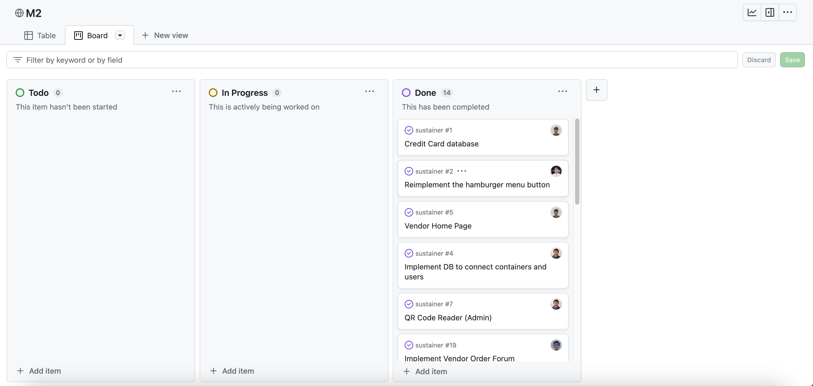

### Milestone 3: App Cleanup

The goal of Milestone 3 was to focus on cleaning up the code base, updating UI format, and container ownership transfer. We also focused on implementing the payment portal and payment management. QR code scanning was refined for both the vendor and admin users. 

Milestone 3 was managed using [Sustainer GitHub Project Board M3](https://github.com/orgs/sus-tainer/projects/4/views/2)

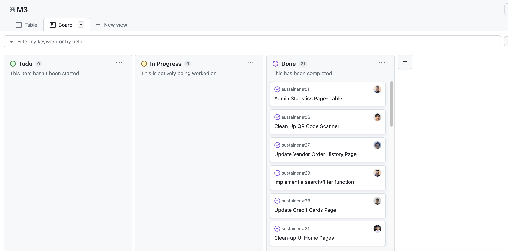

## Team

**[Our team contract](https://docs.google.com/document/d/14BCHuLKtjr0m7UcoQ2BcsHvO0r9Z21xhZkRsPpTkm4c/edit?usp=sharing)**

Sustainer is designed and developed by:
* [**Aaron Lander Ancheta**](https://github.com/aaron-ancheta) || [View Portfolio](https://aaron-ancheta.github.io/)
* [**Nathaniel Murray**](https://github.com/murrayn808) || [View Portfolio](https://murrayn808.github.io/)
* [**Jaren Pinera**](https://github.com/jpinera) || [View Portfolio](https://jpinera.github.io/)
* [**Thomas Rivera**](https://github.com/thomasarivera) || [View Portfolio](https://thomasarivera.github.io/)
* [**Sage Suzuki**](https://github.com/sage-suzuki) || [View Portfolio](https://sage-suzuki.github.io/)

<!--
## Initialization

The [config](https://github.com/bowfolios/bowfolios/tree/main/config) directory is intended to hold settings files.  The repository contains one file: [config/settings.development.json](https://github.com/bowfolios/bowfolios/blob/main/config/settings.development.json).

This file contains default definitions for Profiles, Projects, and Interests and the relationships between them. Consult the walkthrough video for more details.

The settings.development.json file contains a field called "loadAssetsFile". It is set to false, but if you change it to true, then the data in the file app/private/data.json will also be loaded.  The code to do this illustrates how to initialize a system when the initial data exceeds the size limitations for the settings file.


### Quality Assurance

#### ESLint

BowFolios includes a [.eslintrc](https://github.com/bowfolios/bowfolios/blob/main/app/.eslintrc) file to define the coding style adhered to in this application. You can invoke ESLint from the command line as follows:

```
meteor npm run lint
```

Here is sample output indicating that no ESLint errors were detected:

```
$ meteor npm run lint

> bowfolios@ lint /Users/philipjohnson/github/bowfolios/bowfolios/app
> eslint --quiet --ext .jsx --ext .js ./imports ./tests

$
```

ESLint should run without generating any errors.

It's significantly easier to do development with ESLint integrated directly into your IDE (such as IntelliJ).

#### End to End Testing

BowFolios uses [TestCafe](https://devexpress.github.io/testcafe/) to provide automated end-to-end testing.

The BowFolios end-to-end test code employs the page object model design pattern.  In the [bowfolios tests/ directory](https://github.com/bowfolios/bowfolios/tree/main/app/tests), the file [tests.testcafe.js](https://github.com/bowfolios/bowfolios/blob/main/app/tests/tests.testcafe.js) contains the TestCafe test definitions. The remaining files in the directory contain "page object models" for the various pages in the system (i.e. Home, Landing, Interests, etc.) as well as one component (navbar). This organization makes the test code shorter, easier to understand, and easier to debug.

To run the end-to-end tests in development mode, you must first start up a BowFolios instance by invoking `meteor npm run start` in one console window.

Then, in another console window, start up the end-to-end tests with:

```
meteor npm run testcafe
```

You will see browser windows appear and disappear as the tests run.  If the tests finish successfully, you should see the following in your second console window:

```
$ meteor npm run testcafe

> bowfolios@ testcafe /Users/philipjohnson/github/bowfolios/bowfolios/app
> testcafe chrome tests/*.testcafe.js

 Running tests in:
 - Chrome 86.0.4240.111 / macOS 10.15.7

 Bowfolios localhost test with default db
 ✓ Test that landing page shows up
 ✓ Test that signin and signout work
 ✓ Test that signup page, then logout works
 ✓ Test that profiles page displays
 ✓ Test that interests page displays
 ✓ Test that projects page displays
 ✓ Test that home page display and profile modification works
 ✓ Test that addProject page works
 ✓ Test that filter page works


 9 passed (40s)

 $
```

You can also run the testcafe tests in "continuous integration mode".  This mode is appropriate when you want to run the tests using a continuous integration service like Jenkins, Semaphore, CircleCI, etc.  In this case, it is problematic to already have the server running in a separate console, and you cannot have the browser window appear and disappear.

To run the testcafe tests in continuous integration mode, first ensure that BowFolios is not running in any console.

Then, invoke `meteor npm run testcafe-ci`.  You will not see any windows appear.  When the tests finish, the console should look like this:

```
$ meteor npm run testcafe-ci

> bowfolios@ testcafe-ci /Users/philipjohnson/github/bowfolios/bowfolios/app
> testcafe chrome:headless tests/*.testcafe.js -q --app "meteor npm run start"

 Running tests in:
 - Chrome 86.0.4240.111 / macOS 10.15.7

 Bowfolios localhost test with default db
 ✓ Test that landing page shows up (unstable)
 ✓ Test that signin and signout work
 ✓ Test that signup page, then logout works
 ✓ Test that profiles page displays
 ✓ Test that interests page displays
 ✓ Test that projects page displays
 ✓ Test that home page display and profile modification works
 ✓ Test that addProject page works
 ✓ Test that filter page works


 9 passed (56s)

$
```

All the tests pass, but the first test is marked as "unstable". At the time of writing, TestCafe fails the first time it tries to run a test in this mode, but subsequent attempts run normally. To prevent the test run from failing due to this problem with TestCafe, we enable [testcafe quarantine mode](https://devexpress.github.io/testcafe/documentation/guides/basic-guides/run-tests.html#quarantine-mode).

The only impact of quarantine mode should be that the first test is marked as "unstable".

## From mockup to production

Bowfolios is meant to illustrate the use of Meteor for developing an initial proof-of-concept prototype.  For a production application, several additional security-related changes must be implemented:

* Use of email-based password specification for users, and/or use of an alternative authentication mechanism.
* Use of https so that passwords are sent in encrypted format.
* Removal of the insecure package, and the addition of Meteor Methods to replace client-side DB updates.

(Note that these changes do not need to be implemented for ICS 314, although they are relatively straightforward to accomplish.)

## Continuous Integration


BowFolios uses [GitHub Actions](https://docs.github.com/en/free-pro-team@latest/actions) to automatically run ESLint and TestCafe each time a commit is made to the default branch.  You can see the results of all recent "workflows" at [https://github.com/bowfolios/bowfolios/actions](https://github.com/bowfolios/bowfolios/actions).

The workflow definition file is quite simple and is located at
[.github/workflows/ci.yml](https://github.com/bowfolios/bowfolios/blob/main/.github/workflows/ci.yml).

* [Continuous Integration](#continuous-integration)
* [Walkthrough videos](#walkthrough-videos)
* [Example enhancements](#example-enhancements)


* [Meteor](https://www.meteor.com/) for Javascript-based implementation of client and server code.
* [React](https://reactjs.org/) for component-based UI implementation and routing.
* [React Bootstrap](https://react-bootstrap.github.io/) CSS Framework for UI design.
* [Uniforms](https://uniforms.tools/) for React and Semantic UI-based form design and display.

It also provides code that implements a variety of useful design concepts, including:

* Three primary collections (Profiles, Projects, Interests) as well as three "join" Collections (ProfilesInterests, ProfilesProjects, and ProjectsInterests) that implement many-to-many relationships between them.
* Top-level index pages (Profiles, Interests, and Projects) that show how to manipulate these six collections in various ways.
* Initialization code to define default Profiles, Interests, and Projects and relations between them.
* A simple Filter page to illustrate how to perform simple queries on the database and display the results.
* Use of Meteor Methods to illustrate how to simplify implementation of multiple collection updates.
* Use of indexes to enforce uniqueness of certain fields in the collections, enabling them to serve as primary keys.
* Authentication using the built-in Meteor accounts package along with Sign Up and Sign In pages.
* Authorization examples: certain pages are public (Profiles, Projects, Interests), while other pages require login (AddProject, Filter).
* Use of Meteor Assets to initialize the database (helpful when initialization exceeds settings file size limits).
-->

<!--
## Milestone 3: 

The goal of Milestone 3 was to clean up the code base and fix minor UI issues.

Milestone 3 was managed using [BowFolio GitHub Project Board M3](https://github.com/bowfolios/bowfolios/projects/3):


As of the time of writing, this screenshot shows that there is an ongoing task (i.e. this writing).

Need to do:
1. Update mockup page screenshots
3. Update Milestones sections
4. Check if all links work on page
6. Pitch
8. (Make team logo)
-->
